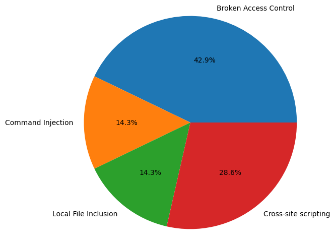

<div align="center">
    <h1>
        Web Fuzzer
    </h1>
    <h4><b>Web Dynamic Analysis Tool</b></h4>
    <h4>
        <a href="#install">Install</a>
        •
        <a href="#roadmap">Roadmap</a>
        •
        <a href="#contact">Contact</a>
        •
        <a href="#copyright">Copyright</a>
    </h4>
</div>

### 
<div align="center">
    <table>
        <tr>
        <th>Vulnerability</th>
        <th>Count</th>
        </tr>
        <tr>
        <td>Broken Access Control</td>
        <td>3</td>
        </tr>
        <tr>
        <td>Command Injection</td>
        <td>1</td>
        </tr>
        <tr>
        <td>Local File Inclusion</td>
        <td>1</td>
        </tr>
        <tr>
        <td>SQL Injection</td>
        <td>1</td>
        </tr>
        <tr>
        <td>Cross-site scripting</td>
        <td>3</td>
        </tr>
        <tr>
        <td colspan='4' style='text-align: right;'>
            <b>Total:</b> 9
        </td>
        </tr>
    </table>
</div>

### Difference 
The [Triumph Mayflower Club](https://www.triumphmayflowerclub.com/) is an organisation dedicated to the preservation of classic 1950s car, the Mayflower, by British car manufacturer Triumph. The club itself formed in 1974 and made its initial, limited foray into the World Wide Web back in [2005](https://legacy.triumphmayflowerclub.com/), and then I ([Andi](https://www.github.com/andiemmadavies), project maintainer) was commissioned in 2017 to create them a new website from scratch when my parents became members. Click [here](https://www.triumphmayflowerclub.com/about) if you’re interested in reading more about the car and the club.

## Install
For now, our Web Fuzzer supports only Windows.

### python 3.10.11 by pyenv
you can skip this step if you have python 3.10.11 already.
```sh
Invoke-WebRequest -UseBasicParsing -Uri "https://raw.githubusercontent.com/pyenv-win/pyenv-win/master/pyenv-win/install-pyenv-win.ps1" -OutFile "./install-pyenv-win.ps1"; &"./install-pyenv-win.ps1"
pyenv install 3.10.11 
```

### clone

```sh
git clone https://github.com/silvergun8291/web_fuzzer.git
cd web_fuzzer
```

### install dependency

```sh 
pip install -r web_fuzzer/requirements.txt
```

### chrome

Chrome is neccessary! we use chrome for selenium webdriver inside.

### usage

```sh
python web_fuzzer/main.py
```
then you can enter information of your target that you want to investigate

### DVWA
if you don't have any target for security testing, here's DVWA for you.


```sh
docker pull vulnerables/web-dvwa
docker run -it -p 80:80 vulnerables/web-dvwa
```
and connect `localhost` in browser with login info

```sh
ID : admin
PW : password
```
after login, click `Create / Reset Database` button in [setup page](http://localhost/setup.php)

if you want to use this env after reboot, you can commit your docker container.

```sh
docker ps -all
docker commit [CONTAINER ID] vulnerables/web-dvwa
```

## Roadmap

This is a non-exhaustive list of the things I’d like to add in future development, in no particular order. This is obviously subject to change, but it should be a good indication of what’s to come. I’ll tick things off as and when they get done. I want to eventually get to a stage where I’ve provided enough tooling so that most of the content can be published by other people, so that I’m freed-up to work primarily on adding new features.

### Features

* Crawling urls from target with credential.
* Customize dictionary for Broken Access Control
* Detect vulnerabilities using GRAMMAR Fuzzer
    * Broken Access Control
    * Command Injection
    * Local File Inclusion
    * SQL Injection
    * XSS
* Generate HTML report

## Contact

If you need to get in-touch with me ([silvergun8291](https://github.com/silvergun8291) – lead developer), please do so at the following email address: sv5506829sv@gmail.com

## Copyright

Copyright © SWLAB@JNU 2023

---